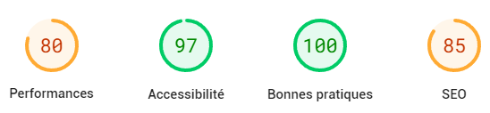
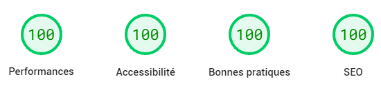

## Why I switched

For my portfolio website 2.0, I choosed to use Vue as my main framework. I had already worked with Vue on my internship at [RGU](https://www.rgu.ac.uk/), so I was already a bit familiar with it.

However, I've had a lot of changes I wanted to make to my website. I wanted to make it have multiple themes like what I did with Lyrical Bomb and to change the projects card component to make them show the technologies used as a link.

Those changes would have probably stayed on the backburner for a while if I didn't stumble upon [Astro](https://astro.build/). Astro's promise is to make static websites way faster utilizing server side hydration and good old HTML. The best way to make a website fast is by loading as little things as possible and, while switching from a single page app to a multi page app isn't always ideal, for my website where users don't load a lot of pages, it's perfect.

With this switch, I plan to make the final version of my porfolio website, with all the features I wanted to add. Since I want to become a full stack developper, I want my next project to have a backend like Lyrical Bomb did.

## What switching changed

The first thing that Astro promises is to make your website faster. This is mainly visible in the time to load the js bundle. With Vue, the js bundle was 1.4 MB (not counting google analytics), while with Astro, it's only 68KB. Astro loads the js exported from the components at build time, so it doesn't need to load the whole Vue library. The page also load the HTML/CSS first, so the user can see the content of the page even without the js.

Having this performance boost, I also tried to optimize the rest of my website with performance in mind. For this, I used [Lighthouse](https://developers.google.com/web/tools/lighthouse) to see what I could improve. To scan your whole website, you can also use [Unlighthouse](https://unlighthouse.dev/).

My previous Vue.js website had this score:

While my new Astro website has this score:

The First Contentful Paint went from 2.6s to 0.9s and the total blocking time went from 470ms to 10ms.

Out of these gains, an estimated 1.8s comes from the switch to Astro, while the rest comes from the rest of the optimizations I made (highlighted in the Lighthouse report).

To get the most out of Astro, I suggest using their [Asset system](https://docs.astro.build/en/guides/assets/) to manage images rather than their [Images Integration](https://docs.astro.build/en/guides/integrations-guide/image/). Doing so allowed me to have width and height attributes on my images automatically as well as converting them to webp. This allowed me to improve the performance even more.
